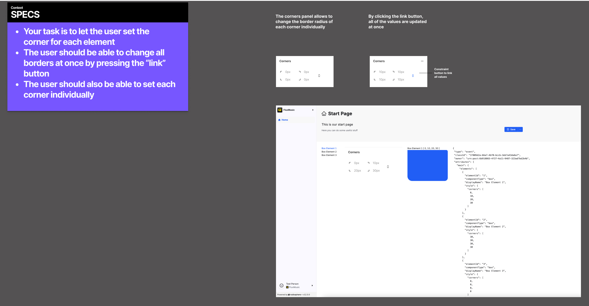

# RsCodingChallenge

- You will work with a datastructure called `ContentGraph`. The `ContentGraph` is the core data structure at radiosphere.
- The `ContentGraph` can contain multiple elements. Each element can bring some attributes and has a style object.
- The style object defines certain style properties for an element like size, background, padding, margin, corners,...
- The repository contains a sample `ContenGraph` object that you can find [here](./src/apps/rs-coding-challenge/public/test-content-graph.json)
- The sample `ContentGraph` object is fetched via the `ContentGraphApi` that you can find [here](./src/apps/rs-coding-challenge/src/app/services/content-graph.api.ts)
- If the user saves the `ContentGraph` it is stored in localstorage. The next time the `ContentGraphApi` retrieves the `ContentGraph`from localstorage instead of fetching the sample json
- The contentGraph is an immutable object. In order to update it you can use [`produce` from `Immer`](https://immerjs.github.io/immer/produce/).


This is how a sample `ContentGraph` object can look like
```json
{
  "type": "event",
  "classId": "some-id",
  "owner": "urn:post:some-id",
  "attributes": {
    "main": {
      "elements": [
        {
          "elementId": "1",
          "componentType": "box",
          "displayName": "Box Element 1",
          "style": {
            "corners": [0, 10, 20, 30] // 0: TopLeft, 1: TopRight, 2: BottomRight, 3: BottomLeft
          }
        },
        {
          "elementId": "2",
          "componentType": "box",
          "displayName": "Box Element 2",
          "style": {
            "corners": [10, 10, 10, 10] // 0: TopLeft, 1: TopRight, 2: BottomRight, 3: BottomLeft
          }
        },
        ...
      ]
    }
  }
}
```

## Your Task
- Your task is to implement a component that lets the user set the border radius (corners) of a content graph element
- The element supports many more styles but for this challenge we focus on the corners setup
- The corners attribute is an array with four values
  - index 0 = Top Left Border Radius
  - index 1 = Top Right Border Radius
  - index 2 = Bottom Right Border Radius
  - index 3 = Bottom Left Border Radius
- The user should also be able to set each corner value individually
- User is also able to style all corners at once using the link button



You can also view the instructions as [PDF]()

## Getting Started
- Fork this repository
- npm install
- npm start
- localhost:4200
- The starting point is in [start-page.component.html](./src/apps/rs-coding-challenge/src/app/pages/start-page.component.html)
- You can use the [unit-input](./src/apps/rs-coding-challenge/src/app/components/unit-input) as input field

## Objective
- This repository should give you an impression about our tech stack and coding style
- To give you a first impression of our codebase it resembles the project setup that you would be working on
- This is just a tiny fraction of our actual project (also the rs-uikit is just a partial)
- We would like to see how well you can handle working on an existing project and how you would implement the given challenge
- Also, we would like to see how you deal with already defined design specs

## Tech Stack
- We are using the latest version of Angular. We are currently migrating to Angular Signals
- We use `Immer` to update immutable objects
- We have a monorepo and use NX for that
- We have our own design library called Rs-Uikit that is build on top of the Ant Design Library. You find a very partial of it [here](/src/libs/rs-uikit) 

## Additional resources
- [Angular Signals](https://angular.dev/guide/signals)
- [Immer](https://immerjs.github.io/immer/)
- [Ant Design Library for Angular Apps](https://ng.ant.design/docs/introduce/en)
- [Ant Design Icons](https://ng.ant.design/components/icon/en#ng-content)
- [NX Getting Started](https://nx.dev/getting-started/intro)
- [Akita State Management](https://github.com/salesforce/akita)

## Demo
This is how the result could look like

https://github.com/user-attachments/assets/b7494435-db61-4c44-87ad-bf61d9df68fb
